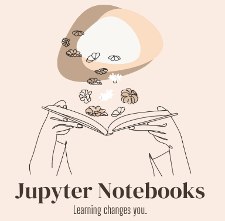

# *Python Core Skills*
  
Must know in Python

- These notebooks are helpful if you want to strengthen your knowledge on the following topics:
    
    * *Lists. Tuples. Dictionaries. Sets*
    * *Conditions. Loops*
    * *Functions*
    * *Objects. Classes*
    * *Writing. Reading. Copying files*
    * *NumPy*
    

Authors

- [@SvetlanaRedkina](https://github.com/SvetlanaRedkina)

Honest feedback

- If you have any feedback, please reach out to me at sveta.hq@gmail.com

I am glad you have visited my project 🌸 
